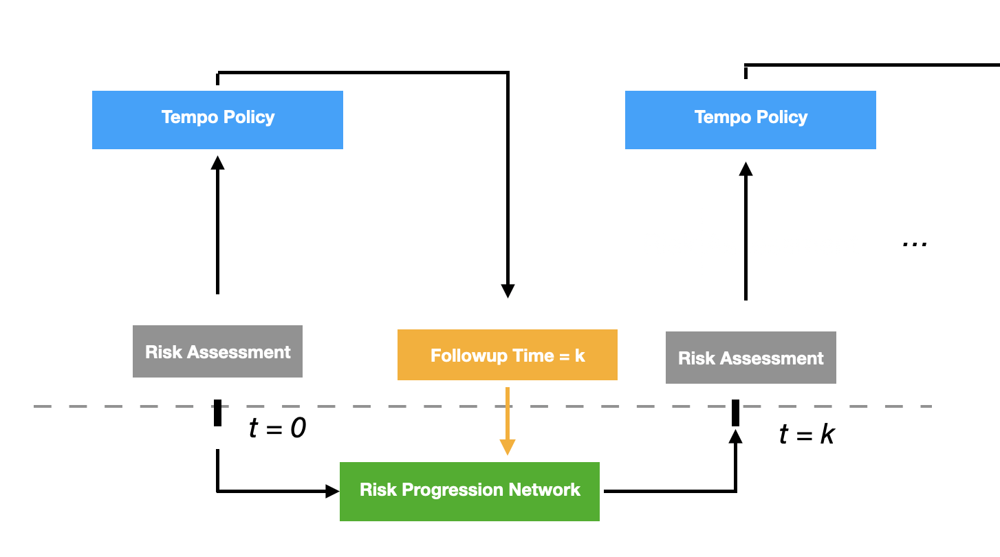

# Tempo: Optimizing risk-based breast cancer screening policies with reinforcement learning

# Introduction
This repository was used to develop Tempo, as described in: [Optimizing risk-based breast cancer screening policies with reinforcement learning](https://www.researchsquare.com/article/rs-104592/v1).

Screening programs must balance the benefits of early detection against the costs of over screening. Here, we introduce a novel reinforcement learning-based framework for personalized screening, Tempo, and demonstrate its efficacy in the context of breast cancer. We trained our risk-based screening policies on a large screening mammography dataset from Massachusetts General Hospital (MGH) USA and validated them on held-out patients from MGH, and on external datasets from Emory USA, Karolinska Sweden and Chang Gung Memorial Hospital (CGMH) Taiwan. Across all test sets, we found that a Tempo policy combined with an image-based AI risk model, Mirai [1] was significantly more efficient than current regimes used in clinical practice in terms of simulated early detection per screen frequency. Moreover, we showed that the same Tempo policy can be easily adapted to a wide range of possible screening preferences, allowing clinicians to select their desired early detection to screening cost trade-off without training new policies. Finally, we demonstrated Tempo policies based on AI-based risk models out performed Tempo policies based on less accurate clinical risk models. Altogether, our results show that pairing AI-based risk models with agile AI-designed screening policies has the potential to improve screening programs,  advancing early detection while reducing over-screening.

This code base is meant to provide exact implementation details for the development of Tempo.

## Aside on Software Depedencies
This code assumes python3.6 and a Linux environment.
The package requirements can be install with pip:

`pip install -r requirements.txt`

Tempo-Mirai assumes access to Mirai risk assessments. Resources for using Mirai are shown [here](https://github.com/yala/mirai).

# Method


Our full framework, named Tempo, is depicted above.  As described above, we first train a risk progression neural network to predict future risk assessments given previous assessments. This model is then used to estimate patient risk at unobserved timepoints and it enables us to simulate risk-based screening policies. Next, we train our screening policy, which is implemented as a neural network, to maximize the reward (i.e combination of early detection and screening cost) on our retrospective training set. We train our screening policy to support all possible early detection vs screening cost trade-offs using envelope Q-learning [2], an RL algorithm designed to balance multiple objectives. The input of our screening policies is the patient's risk assessment, and desired weighting between rewards (i.e screening preference). The output of the policy is a recommendation for when to return for the next screen, ranging from six months to three years in the future, in multiples of six months. Our reward balances two contrasting aspects, one reflecting the imaging cost, i.e., the average mammograms a year recommended by the policy, and one modeling early detection benefit relative to the retrospective screening trajectory. Our early detection reward measures the time difference in months between each patient's recommended screening date, if it was after their last negative mammogram, and their actual diagnosis date. We evaluate screening policies by simulating their recommendations for heldout patients.

## Training Risk progression models
We experimented with different learning rates, hidden sizes, numbers of layers and dropout, and chose the model that obtained the lowest validation KL divergence on the MGH validation set. Our final risk progression RNN had two layers, a hidden dimension size of 100, a dropout of 0.25, and was trained for 30 epochs with a learning rate of 1e-3 using the Adam optimizer.

To reproduce our grid search for our Mirai risk progression model, you can run:
```
python scripts/dispatcher.py --experiment_config_path configs/risk_progression/gru.json
```

Given a trained risk progression model, we can now estimate unobserved risk assessments auto-regressively. At each time step, the model takes as input the previous risk assessment, the prior hidden state, using the previous predicted assessment if the real one is not available, and predicts the risk assessment at the next time step.

## Training Tempo Personalized Screening Policies

We implemented our personalized screening policy as multiple layer perceptron, which took as input a risk assessment and weighting between rewards and predicted the Q-value for each action, i.e follow up recommendation, across the rewards. This network was trained using Envelope Q-Learning [2]. We experimented with different numbers of layers, hidden dimension sizes, learning rates, dropouts, exploration epsilons, target network reset rates and weight decay rates.

To reproduce our grid search for our Mirai risk progression model, you can run:
```
python scripts/dispatcher.py --experiment_config_path configs/screening/neural.json
```


### Data availability
All datasets were used under license to the respective hospital system for the current study and are not publicly available. To access the MGH dataset, investigators should reach out to C.L. to apply for an IRB approved research collaboration and obtain an appropriate Data Use Agreement. To access the Karolinska dataset, investigators should reach out to F.S. to apply for an approved research collaboration and sign a Data Use Agreement. To access the CGMH dataset, investigators should contact G.L. to apply for an IRB approved research collaboration. To access the Emory dataset, investigators should reach out to H.T to apply for an approved collaboration.


### References
[1] Yala, Adam, et al. "Toward robust mammography-based models for breast cancer risk." Science Translational Medicine 13.578 (2021).


[2] Yang, Runzhe, Xingyuan Sun, and Karthik Narasimhan. "A generalized algorithm for multi-objective reinforcement learning and policy adaptation." arXiv preprint arXiv:1908.08342 (2019).

## Citing Tempo
```
@article{yala2021optimizing,
  title={Optimizing risk-based breast cancer screening policies with reinforcement learning},
  author={Yala, Adam and Mikhael, Peter and Lehman, Constance and Lin, Gigin and Strand, Fredrik and Wang, Yung-Liang and Hughes, Kevin and Satuluru, Siddharth and Kim, Thomas and Banerjee, Imon and others},
  year={2021}
}
```